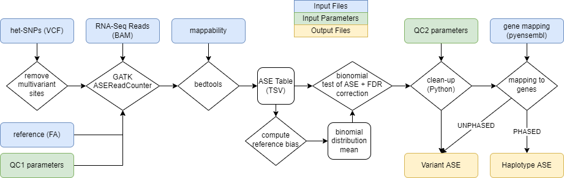

# Allele Specific Expression (ASE)

This is a [ICGC-ARGO](https://www.icgc-argo.org/) pipeline for analysis of allele specific expression (ASE) based on RNA-seq data. 

## Pipeline

The pipeline processes a reads file (`BAM`/`SAM`) and its accompanying variant call files (`VCF`) together with their matching reference (`FA`) file and produces, for each SNP, the allele-specific expression ratio and the probability that true ASE is occuring.Using a (`GTF`) file the positions are also mapped to genes. 

If the data are additionally phased, the haplotype-specific expression for each gene is computed.

The whole pipeline operates as illustrated:

The pipeline can be modified using the following quality control parameters:

* QC paramters (applied before ASE read counter)
    * read depth (`16`)
    * read mapping quality (`20`)
    * read calling quality (`10`)
    * read mappability (`0.05`)

## Output

For a file `sample_name.bam` we obtain the following outputs: 
* `sample_name.tsv`: tab separated document detailing the results of the ASE analysis with the following result columns:
    * `ase_ratio`: the RAF adjusted for mean bias towards reference
    * `ref_bias`: the ration of reference counts vs total read counts for the particular base pair
    * `AEI_pval`: the resulting p-value of binomial statistical test
    * `AEI_padj`: the p-value corrected using Benjamini/Hochberg false discovery rate correction. The AE is present if `p < 0.5`. 
    * `gene_id`: if a genome file is provided, maps to an Ensembl gene id
    * `gene_feature`: if a genome file is provided, maps to an Ensembl gene feature (exon/intron)
* `sample_name.gene.log`: a log file of the ASE calculation and filtering
* `sample_name.vaf.png`: a histogram of `ase_ratio` occurences. In a healthy sample the values should be around 0.5.
* `sample_name.hap.tsv`: if a genome file is provided and the data are phased, the results of ASE mapped to genes, the result colums are:
    * `positions`: how many positions are covered by a gene
    * `HSE_ratio`: ratio of the first haplotype vs. total
    * `HEI_pval`: the resulting p-value of binomial statistical test for the gene
    * `HEI_padj`: the FDR B/H p-value correction
* `sample_name.hap.log`: a log file of the haplotype specific expression calculation

## Reference files used 

The following human genome files have been tested with the pipeline:

#### RNA-seq reference genome
`https://object.cancercollaboratory.org:9080/swift/v1/genomics-public-data/rna-seq-references/GRCh38_Verily_v1.genome/GRCh38_Verily_v1.genome.fa.gz`

#### mappability file
`https://bismap.hoffmanlab.org/raw/hg38/k50.umap.bedgraph.gz`

#### gene mapping
`https://object.cancercollaboratory.org:9080/swift/v1/genomics-public-data/rna-seq-references/GRCh38_Verily_v1.annotation/gencode.v40.chr_patch_hapl_scaff.annotation.gtf`

## Contact
Email questions, feature requests and bug reports to **Adam Streck, adam.streck@mdc-berlin.de**.

## License
`icgc-argo-workflows/allele-sepecific-expression` is available under the MIT License. 

### Further reading

[Tools and best practices for data processing in allelic expression analysis, Castel et al.](https://genomebiology.biomedcentral.com/articles/10.1186/s13059-015-0762-6)